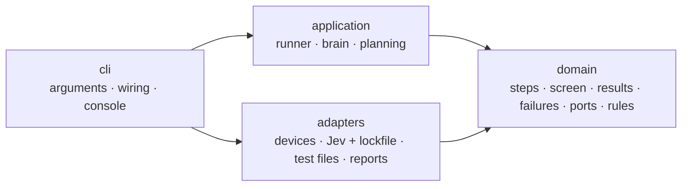

# Architecture

jevtest follows one rule: **source-code dependencies point inward**, toward the part that changes least. The things that change most often (Android and iOS tooling, the model's HTTP API, file formats, the terminal) sit on the outside. What jevtest *is* sits in the middle, untouched by any of them.



The rule is checked on every commit by [import-linter](https://import-linter.readthedocs.io): the build fails if any import points the wrong way.

## The layers

| Layer | What it holds | May import | Must never |
|---|---|---|---|
| `domain` | What jevtest *is*: steps and checks, the screen, decisions, results, failures, fixed rules, and the **ports** (interfaces) for devices, the decision model and time | the standard library's pure parts only | import any other layer, I/O, or a third-party package |
| `application` | How tests run: the test runner, the brain that asks the model questions, sharding tests across devices | `domain` | touch a device, the network, a file or the terminal except through a port |
| `adapters` | Everything outside: Android and iOS devices, the Jev client and lockfile, YAML test files and `.env`, JUnit and JSON reports | `domain` | import `application` or `cli`; let a tool's exception escape |
| `cli` | The command line: arguments, the console output, and the **composition root**, the one place that picks real implementations for the ports | everything | hold test logic |

## What crosses between them

Each layer hands the next one plain, immutable domain types:

- The **loader** (adapter) turns YAML into a `Suite` of typed `Step`s: one class per action (`Touch`, `TypeText`, `ScrollTo`, …), so a step can only carry what its action needs.
- A **device** (adapter) turns the agent's XML or JSON into a frozen `Screen` of `Element`s. The wire format never leaves the adapter.
- The **brain** (application) asks typed `Choice` and `YesNo` questions. The **Jev adapter** turns them into Jev's JSON, checks every answer against the options offered, and returns `Picked` and `Probability` answers.
- The **runner** (application) returns `RunResult`, `TestResult`, `StepResult` and `CheckResult` records, and reports progress through the `RunListener` port. The **console** (cli) renders them; the **report adapters** write them as JUnit and JSON.

## Errors

Adapters catch the exceptions of the tools they wrap (`subprocess`, HTTP, YAML) and raise one of four domain failures instead: `TestFileError`, `DeviceError`, `ModelError`, or `StepFailed`. Nothing outside an adapter ever handles a tool's exception. Every message says what to fix. The CLI prints `TestFileError`, `DeviceError` and `ModelError` as `error: …` and exits 2; `StepFailed` fails a test and the run goes on.

## The ports

```python
class Device(Protocol):        # a phone, emulator or simulator with the app installed
    def screen(self) -> Screen: ...
    def tap(self, x: int, y: int) -> None: ...
    ...

class DecisionModel(Protocol): # Jev behind its lockfile
    def ask(self, state: State, questions: Mapping[str, Question]) -> Mapping[str, Answer]: ...

class Clock(Protocol): ...     # time, so tests run instantly
class RunListener(Protocol): ...  # told what happens as tests run
```

The application depends only on these. `jevtest.cli.main` wires real implementations to them, and the tests wire fakes. That is why every layer is tested without the layer below it: the runner against a `FakeDevice` and a `FakeModel`, the device adapters against recorded agent output, the Jev adapter against a fake HTTP opener.

## Checks that keep it this way

| Check | Command | Enforced |
|---|---|---|
| Dependencies point inward | `lint-imports` | CI, pre-commit |
| Types | `mypy --strict` | CI, pre-commit |
| Lint, including a docstring on every public object | `ruff check .` | CI, pre-commit |
| Tests, 100% line and branch coverage | `pytest --cov` | CI, pre-commit |
| Docs build, no broken links or anchors | `mkdocs build --strict` | CI |
