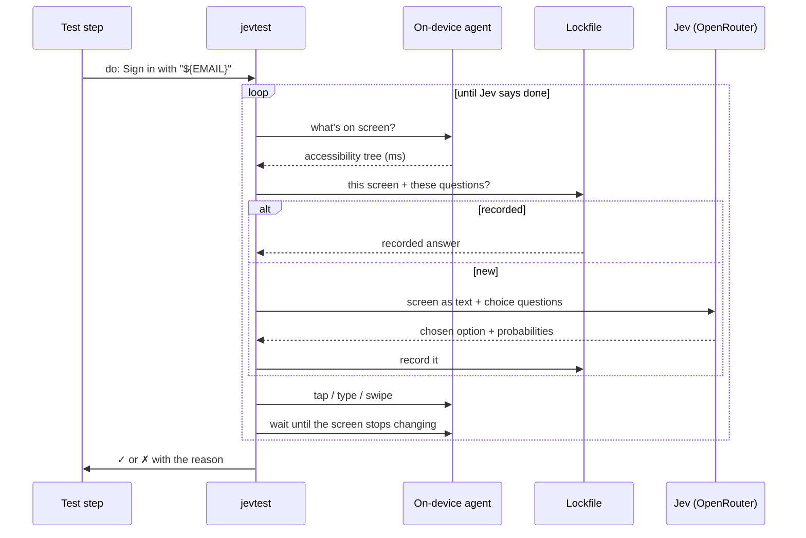

# How it works

## The loop

1. **Read the screen.** A small agent on the device (an instrumentation APK on Android, an XCUITest runner on iOS) stays running for the whole run and returns the accessibility tree in milliseconds (about 3 ms on Android, 40 ms on iOS).
2. **Describe it as text.** Each element becomes a short line: `{"id": "e4", "type": "button", "text": "Sign in", "position": "top-center"}`.
3. **Ask Jev to choose.** One request, several questions: *what's the next action* (tap, type, scroll, back, done, impossible, …), *on which element*, and *which quoted value to type*. Jev answers each by choosing one of the options, with probabilities.
4. **Act** through the agent or `adb`, then **wait** until the screen stops changing.
5. **Repeat** until Jev answers `done` or `impossible`. A goal gets at most 10 actions, or its [`max_actions`](reference/test-file.md#settings-optional).

`expect:` checks are one yes/no question each, passed when Jev finds the statement more likely true than false (yes-probability above 0.5, or the [`confidence`](reference/test-file.md#settings-optional) setting). `see:` and `not_see:` never ask Jev.

## Finding what a step names

`tap: Save`, `see: Saved` and `scroll_to: Item 30` are matched in code, **exactly**: an element matches when its text, a part of its text (an iOS label or value, an Android text or description), its hint or its id is the target, case and all ([details](reference/steps.md#matching)). There's no "contains" anywhere, so a step never lands on *Unsaved changes* or *Save draft*, and `see: "Taps: 2"` never passes on *Taps: 20*.

Jev is involved only when code can't decide:

- **Several exact matches** (two *Delete* buttons): Jev chooses among those only, and the step output says so.
- **A description**, not on-screen text (`tap: the gear icon`): Jev picks an element, then must confirm it with a yes/no question; the output says `(chosen by Jev)`.

If a target isn't on screen but a close text is (another case, or a longer text containing it), the step fails and lists the close texts. They are never used, and Jev isn't asked: a near miss is a test-file mistake, not a description.

## Jev

Jev is TypeSafe's decision model, reached through [OpenRouter](https://openrouter.ai). It reads text and answers **by choosing from options it's given**: it never writes free text. That's why jevtest can trust it with a test: everything it does is one of a fixed list of actions on one of the elements actually on screen, and everything typed comes from your test file.

jevtest uses no other model. Each release of jevtest is built and tested against one pinned Jev version (`typesafe/jev-1.13`), printed at the start of every run, so an update on OpenRouter's side can't change behaviour underneath you. A new Jev version comes with a new jevtest release.

## The lockfile

Jev's probabilities wobble slightly between identical calls, so a close decision can come out differently. Measured on this project: across 20 identical repeats, 4 of 97 action decisions changed at least once. Yes/no checks never changed.

So jevtest records every decision in a **lockfile** next to the test file (`tests.yaml` → `tests.lock.json`), keyed by a hash of the exact model, screen and questions:

- The **first** time a screen is seen, Jev is asked and the answer is recorded.
- After that, the **same screen and question always get the same answer**, with no network call.
- If the app changes, its screen text changes, so it's a **new** question and Jev is asked fresh. A recorded answer is never applied to a screen it wasn't recorded on.

Commit the lockfile. [`--lock`](reference/cli.md#lock-modes) says how each run uses it, and [`--prune-lock`](reference/cli.md#-prune-lock) removes answers for screens that no longer exist.

## Waiting without sleeping

jevtest has no fixed sleeps. It reacts to the device:

- **After an action** it waits until the screen has not changed for 150 ms (0.5 s after launching the app, because apps pause longer while starting), up to 3 seconds (the [`settle`](reference/test-file.md#settings-optional) setting).
    - On Android, "changed" means the accessibility tree, plus the pixels while a window is opening or closing: a dialog sliding in reports its final position only when it lands, so only the pixels show it moving. A blinking cursor or a ripple inside a window that stays put isn't waited for.
    - On iOS there are no change events, so the agent compares snapshots, as WebDriverAgent and Maestro do.
- **When a check or element isn't there yet**, it waits for the screen to change, then looks again. Jev is asked again only when the screen actually changed.

## Nothing assumed

jevtest never fills a gap for you:

- No default device, lock mode or results folder: the test file and the command say everything. [Settings](reference/test-file.md#settings-optional) have defaults that suit most apps, and limits that stop a test from hiding a broken app.
- A misspelled step, a value of the wrong type or an option on the wrong action is an error, never a guess. `- bakc` doesn't become a goal for Jev; `wait: "2"` isn't quietly read as 2.
- The whole test file is checked before any device is touched, and every problem is reported at once.
- A device name must match exactly one device.
- A secret set differently in `.env` and the environment is an error, not a choice.

## Never changing the app or the device

jevtest tests the app as users get it. It doesn't turn off animations, speed anything up, grant permissions, or change device settings on its own. It installs your build and its own agent, and changes only what a step asks for (`rotate:`, `dark_mode:`, `network:`, `location:`), and it [puts those back](guides/real-devices.md#leaving-the-phone-as-it-was) at the end of the run.
