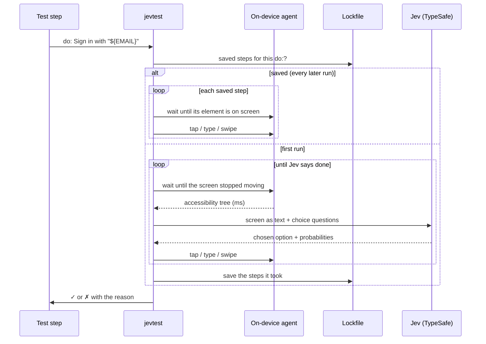

# How it works

## The loop



1. **Read the screen.** A small agent on the device (an instrumentation APK on Android, an XCUITest runner on iOS) stays running for the whole run and returns the accessibility tree in milliseconds (about 3 ms on Android, 40 ms on iOS).
2. **Describe it as text.** Each element becomes a short line: `{"id": "e4", "type": "button", "text": "Sign in", "position": "top-center"}`.
3. **Ask Jev to choose.** One request, several questions: *what's the next action* (tap, type, scroll, back, done, impossible, …), *on which element*, and *which quoted value to type*. Jev answers each by choosing one of the options, with probabilities.
4. **Act** through the agent or `adb`, and **save the step**: its action and its element, by kind and name (and which one, if several have that name).
5. **Repeat** until Jev answers `done` or `impossible`. A goal gets at most 10 actions, or its [`max_actions`](reference/test-file.md#settings-optional).

Later runs don't ask Jev at all: they repeat the saved steps, each waiting until its element is on screen, like a `tap:` does.

`expect:` checks are one yes/no question each, passed when Jev finds the statement more likely true than false (yes-probability above 0.5, or the [`confidence`](reference/test-file.md#settings-optional) setting). `see:` and `not_see:` never ask Jev.

## Finding what a step names

`tap: Save`, `see: Saved` and `scroll_to: Item 30` are matched in code, **exactly**: an element matches when its whole text, a part of its text (an iOS label or value, an Android text or description), its hint or its id is the target, ignoring case ([details](reference/steps.md#matching)). There's no "contains" anywhere, so a step never lands on *Unsaved changes* or *Save draft*, and `see: "Taps: 2"` never passes on *Taps: 20*.

A step never guesses. If nothing says the target, it waits for it, and fails at its `timeout` with the texts that come close. To describe something instead of naming it (an icon, a field with no label), write a `do:` step.

Jev is involved in an exact step only when **several elements say the target exactly** (two *Delete* buttons): Jev chooses among those only, must confirm its choice, and the output says so.

## Jev

Jev is TypeSafe's decision model, reached through [TypeSafe's API](https://docs.typesafe.ai/api). It reads text and answers **by choosing from options it's given**: it never writes free text. That's why jevtest can trust it with a test: everything it does is one of a fixed list of actions on one of the elements actually on screen, and everything typed comes from your test file.

jevtest uses no other model. Each release of jevtest is built and tested against one pinned Jev version (`jev-1.13.0`), printed at the start of every run, so a new Jev can't change behaviour underneath you. A test file's `model` must be a pinned version too: an alias such as `jev-latest` moves when a new Jev ships. A new Jev version comes with a new jevtest release.

## The lockfile

Jev's probabilities wobble slightly between identical calls, so a close decision can come out differently. Measured on this project: across 20 identical repeats, 4 of 97 action decisions changed at least once. Yes/no checks never changed.

So jevtest keeps a **lockfile** next to the test file (`tests.yaml` → `tests.lock.json`) with:

- **The steps each `do:` took** the first time, worked out by Jev. Every later run repeats exactly those steps, with no network call, and they don't depend on the screen looking exactly as it did: each one only needs its element on screen.
- **Jev's answer to every other question** (an `expect:`, which of several exact matches a step means), keyed by a hash of the exact model, screen and question: the same screen and question always get the same answer. A recorded answer is never applied to a screen it wasn't recorded on.

If the app changes (a button is renamed), a saved step's element never shows up: `--lock record` works that `do:` out again from where it got to, and `--lock frozen` fails and says so.

Commit the lockfile. [`--lock`](reference/cli.md#lock-modes) says how each run uses it, and [`--prune-lock`](reference/cli.md#-prune-lock) removes what a run no longer used.

## Waiting: wait until, or fail

Every wait in jevtest is the same thing: **wait until a condition is true**, checking it every `interval` (0.25 s), for at most the step's `timeout` (10 s). If it isn't true by then, the step fails and says what it waited for:

```text
✗ tap: Save — Waited 10s until an element says 'Save' on screen and stopped moving; close but not exact: 'Save draft'
```

| Step | Waits until |
|---|---|
| `tap:`, `type: … into:`, `clear:`, `swipe: … target:` | an element says the target and has stopped moving: it's in the same place at two checks in a row (on Android, and drawn the same: a system dialog fading in reports its final place at once, so only its pixels show it moving), so a tap never lands where a sliding page's button was a moment ago (and it isn't under the keyboard) |
| `see:` / `not_see:` | the text is on screen / gone |
| `expect:` | Jev judges it true of a screen that stopped moving (asked once per such screen) |
| a saved `do:` step | its element is on screen and has stopped moving |
| working a `do:` out with Jev | the screen stopped moving (it reads the same at two checks in a row) |
| `scroll_to:`, before its first look and after each scroll | the screen stopped moving |
| `hide_keyboard`, `rotate:` | the keyboard is gone / the screen has turned (3 s) |

An action doesn't wait afterwards: the next step waits for what it needs. The on-device agents never wait either; they answer each read at once.

## Nothing assumed

jevtest never fills a gap for you:

- No default device, lock mode or results folder: the test file and the command say everything. [Settings](reference/test-file.md#settings-optional) have defaults that suit most apps, and limits that stop a test from hiding a broken app.
- A misspelled step, a value of the wrong type or an option on the wrong action is an error, never a guess. `- bakc` doesn't become a goal for Jev; `wait: "2"` isn't quietly read as 2.
- The whole test file is checked before any device is touched, and every problem is reported at once.
- A device name must match exactly one device.
- A secret set differently in `.env` and the environment is an error, not a choice.

## Never changing the app or the device

jevtest tests the app as users get it. It doesn't turn off animations, speed anything up, grant permissions, or change device settings on its own. It installs your build and its own agent, and changes only what a step asks for (`rotate:`, `dark_mode:`, `network:`, `location:`), and it [puts those back](guides/real-devices.md#leaving-the-phone-as-it-was) at the end of the run.
