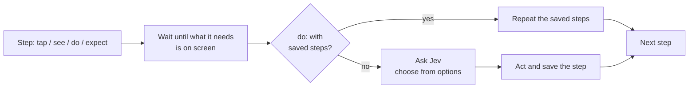

---
hide:
  - navigation
---

# jevtest

**Plain-English end-to-end tests for Android and iOS apps.** Write what a user does and what they should see; [Jev](https://docs.typesafe.ai) works out the taps. Every run is recorded, so CI replays it exactly, offline.

```yaml title="login.yaml"
app: build/app-debug.apk
device: { android: emulator-5554 }

tests:
  - name: Sign in
    fresh: true
    steps:
      - do: Sign in with email "${DEMO_EMAIL}" and password "${DEMO_PASSWORD}"
        expect: The home screen is showing
        see: Welcome, ${DEMO_EMAIL}
```

```console
$ jevtest run login.yaml --lock frozen --out results
jevtest 0.9.8 · android · emulator-5554 · dev.jevtest.jevtest_demo · jev-1.13.0 · lockfile: frozen

▶ Sign in
  ✓ do: Sign in with email "${DEMO_EMAIL}" and password "${DEMO_PASSWORD}" (2.6s) — 3 saved steps
      → type "${DEMO_EMAIL}" into text_field 'Email'
      → type "${DEMO_PASSWORD}" into password_field 'Password'
      → tap button 'Sign in'
      ✓ expect: The home screen is showing — Jev 0.96
      ✓ see: Welcome, ${DEMO_EMAIL}
  PASS Sign in (5.1s)

1/1 passed in 5s
Jev: 1 decision, 1 from lockfile, 0 asked live in 0.0s (0% of run time), $0.0000
Results: results/20260928-161344/android/emulator-5554
```

<small>Real output from the demo app on an Android emulator. `${DEMO_PASSWORD}` comes from `.env`: logs and reports only ever show the name.</small>

[Get started :material-arrow-right:](getting-started.md){ .md-button .md-button--primary }
[Writing tests](writing-tests.md){ .md-button }

## Why jevtest

<div class="grid cards" markdown>

-   :material-script-text-outline: **Tests read like the spec**

    One action, then what should be true. `do:` takes a plain-English goal; `tap:`, `type:`, `swipe:` and 23 more are there when you want exact control.

-   :material-lock-check-outline: **Deterministic by design**

    The first run saves the steps Jev worked out for each `do:`, and its answers to every check, in a lockfile. Later runs repeat them exactly, with no network and no API key.

-   :material-alert-octagon-outline: **Nothing assumed**

    No default device, no guessing what a typo meant, and settings with good defaults and strict limits. Anything missing or wrong fails before the run starts, and says exactly what to fix.

-   :material-cellphone-link: **Real apps, real phones**

    Android emulators and phones, iOS simulators and iPhones. Native, Flutter, React Native, and **in-app WebViews**, all driven the same way. jevtest never turns off animations, and puts back what a step changes on the device (all but an Android emulator's location).

-   :material-timer-sand-complete: **Wait until, or fail**

    Each step waits until what it needs is on screen, up to its timeout, and then fails saying what it waited for. No sleeps, no guessing when the app is "ready".

-   :material-server-network: **Built for CI**

    JUnit XML, a JSON report of every step and decision, screenshots of failures, one exit code. Split tests across several devices and run them at the same time.

</div>

## How it works, in one picture



Jev is TypeSafe's decision model: it reads text and **chooses from the options jevtest gives it**. It never writes free text, so what gets typed always comes from your test file. [More on how it works](how-it-works.md).

## Status

jevtest is new. It is tested end to end on a Flutter demo app with native and web screens, on the Android emulator (API 37), a Pixel 4a (Android 13), iOS simulators (iOS 26) and an iPhone 17 (iOS 27), with 100% line and branch coverage in its unit tests. Issues and pull requests are welcome.
