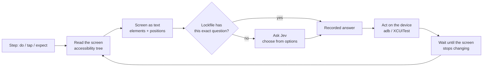

---
hide:
  - navigation
---

# jevtest

**Plain-English end-to-end tests for Android and iOS apps.** Write what a user does and what they should see; [Jev](https://openrouter.ai/typesafe) works out the taps. Every run is recorded, so CI replays it exactly, offline.

```yaml title="login.yaml"
app: build/app-debug.apk
device: { android: emulator-5554 }

tests:
  - name: Sign in
    fresh: true
    steps:
      - do: Sign in with email "${DEMO_EMAIL}" and password "${DEMO_PASSWORD}"
        expect: The home screen is showing
        see: Welcome, ${DEMO_EMAIL}
```

```console
$ jevtest run login.yaml --lock frozen --out results
jevtest 0.4.0 · android · emulator-5554 · dev.jevtest.jevtest_demo · typesafe/jev-1.13 · lockfile: frozen

▶ Sign in
  ✓ do: Sign in with email "${DEMO_EMAIL}" and password "${DEMO_PASSWORD}" (2.7s) — 3 action(s)
      → type "${DEMO_EMAIL}" into text_field 'Email'  (confidence 0.83)
      → type "${DEMO_PASSWORD}" into password_field 'Password'  (confidence 0.76)
      → tap button 'Sign in'  (confidence 0.93)
      → done  (confidence 0.96)
      ✓ expect: The home screen is showing — Jev 0.95
      ✓ see: Welcome, ${DEMO_EMAIL}
  PASS Sign in (7.1s)

1/1 passed in 7s
Jev: 5 decisions, 5 from lockfile, 0 asked live in 0.0s (0% of run time), $0.0000
```

<small>Real output from the demo app on an Android emulator. `${DEMO_PASSWORD}` comes from `.env`: logs and reports only ever show the name.</small>

[Get started :material-arrow-right:](getting-started.md){ .md-button .md-button--primary }
[Writing tests](writing-tests.md){ .md-button }

## Why jevtest

<div class="grid cards" markdown>

-   :material-script-text-outline: **Tests read like the spec**

    One action, then what should be true. `do:` takes a plain-English goal; `tap:`, `type:`, `swipe:` and 20 more are there when you want exact control.

-   :material-lock-check-outline: **Deterministic by design**

    Every Jev decision is recorded in a lockfile. `--lock frozen` replays a run exactly, with no network and no API key. A changed screen is a new question, never a stale answer.

-   :material-alert-octagon-outline: **Nothing assumed**

    No settings file, no default device, no guessing what a typo meant. Anything missing or wrong fails before the run starts, and says exactly what to fix.

-   :material-cellphone-link: **Real apps, real phones**

    Android emulators and phones, iOS simulators and iPhones. Native, Flutter, React Native, and **in-app WebViews**, all driven the same way. jevtest never turns off animations or changes the device.

-   :material-timer-sand-complete: **No sleeps**

    It waits for the screen to stop changing, reacting to the device, not a timer. Content that loads late passes when it arrives.

-   :material-server-network: **Built for CI**

    JUnit XML, a JSON report of every step and decision, screenshots of failures, one exit code. Split tests across several devices and run them at the same time.

</div>

## How it works, in one picture



Jev is TypeSafe's decision model: it reads text and **chooses from the options jevtest gives it**. It never writes free text, so what gets typed always comes from your test file. [More on how it works](how-it-works.md).

## Status

jevtest is new. It is tested end to end on a Flutter demo app with native and web screens, on the Android emulator (API 37), a Pixel 4a (Android 13), iOS simulators (iOS 26) and an iPhone 17 (iOS 27), with 100% line and branch coverage in its unit tests. Issues and pull requests are welcome.
